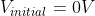
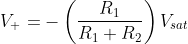

### Theory

 A multivibrator is an electronic circuit that is used to implement two-state devices like oscillators, timers, and flip-flops. Two states refer to two voltage levels of multivibrators. 
 For e.g.: High and low in digital circuits. is nothing but a switching circuit.   
 A multivibrator generates non-sinusoidal waves such as square waves, rectangular waves, saw tooth waves, etc. Multivibrators are used as frequency generators, frequency dividers, and generators of time delays and as memory elements in computers, etc. 

**1. Monostable Multivibrator using Op-Amp**   
 This kind of multivibrator is one in which one of the states is stable, but the other state is unstable (transient). A trigger pulse causes the circuit to enter an unstable state. After entering the unstable state, the circuit will return to the stable state after a set time. Such a circuit is useful for creating a timing period of fixed duration in response to some external event.  The feedback from the output is fed to the non-inverting terminal. Hence, feedback is positive. Consider there are two saturation states 

    

At this time, the voltage at non-inverting terminal

    

 
Diode, D will be in forward bias when 

 

   

So, the voltage across the capacitor = forward voltage drop across the diode
At time t, a negative trigger is applied at the non-inverting node. Then the voltage at the non-inverting node momentarily becomes less than the voltage at inverting node. So, the output switches from .

Now, the voltage at the non-inverting node will be .

    

When  , the diode will be in reverse bias and the capacitor charging towards .

As soon as the voltage at the inverting node goes below, , the output voltage switches from . The output remains in an unstable state till the time T. Then the diode becomes forward bias once again and the voltage drop across the capacitor = forward voltage drop across the diode.

 

**How to find T**

Assume the diode is ideal ⟹ voltage drop across the capacitor is zero. Hence, the capacitor starts charging from 0 V to  .

    

 
   Here,  = 0V

 

 

 

 

    

  

 

,  where τ=RC

Trigger signal time period should be ˂ T

 

**2. Bistable Multivibrator Using op-Amp**

 In the bistable multivibrator, the circuit is stable in either state. It can be flipped from one state to the other by an external trigger pulse. This circuit is also known as a latch. It can store one bit of information and is widely used in digital logic and computer memory.

 

    

 

 

 

 

 

 

Case I) Let 

After time t1, apply trigger

  

   If

   If  

 

Case I) Let 

After time t2, apply trigger

   
   

 

   If  

 

 

    

